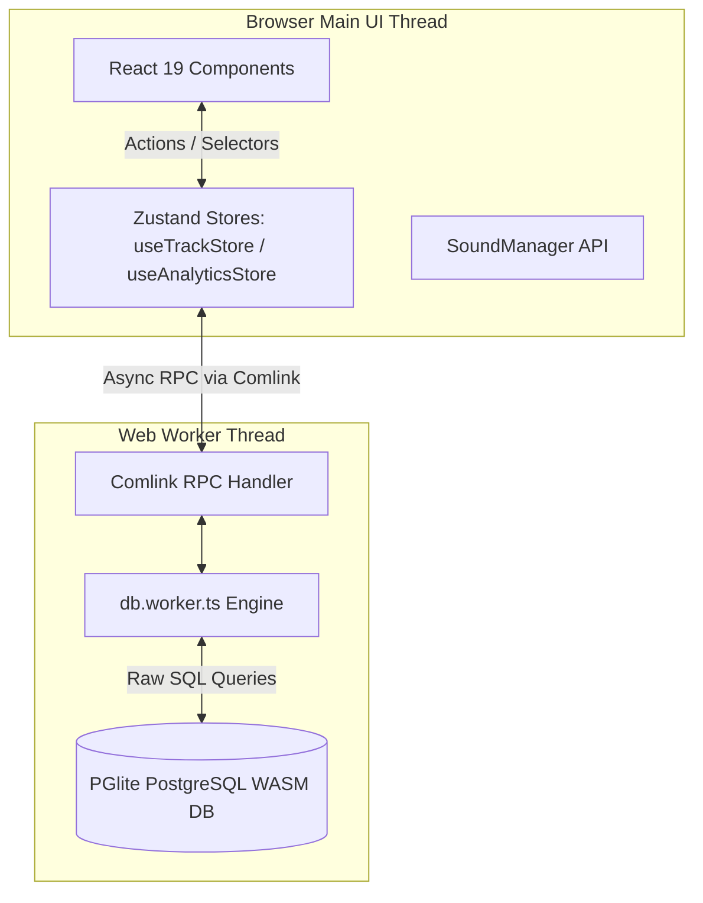
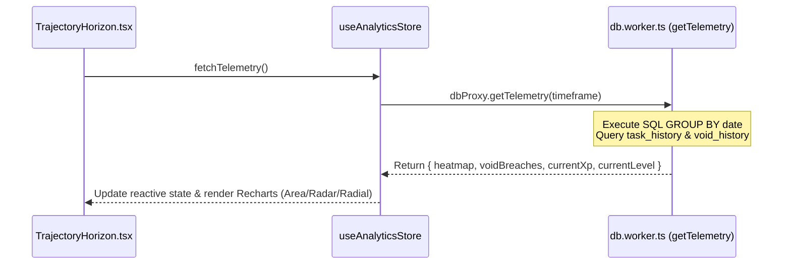

# 🏛️ Space-Clocker Architecture Blueprint

**Document Owner:** Winston (System Architect)  
**Version:** `v1.10.0`

---

## 1. High-Level Architecture Overview

Space-Clocker follows a **Local-First, WASM-Powered Architecture**. The core application logic runs completely within the user's browser, persisting state into a WebAssembly build of PostgreSQL (`PGlite`) offloaded to a dedicated Web Worker thread.

---

## 2. Database & Thread Isolation (`db.worker.ts`)

### Why Web Worker + WASM PostgreSQL?
Executing complex time-series queries (e.g., aggregating 3 years of daily telemetry, computing Void breach frequencies, or conducting skill proficiency rollups) on the main React thread causes frame drops and UI unresponsiveness.

By running `PGlite` inside `src/db/db.worker.ts`:
1. **Zero UI Blocking:** All SQL parsing, indexing, and data transformations happen off the main thread.
2. **Type-Safe RPC:** `Comlink` wraps the worker instance, allowing Zustand stores to invoke database methods using standard `async/await` syntax.
3. **OPFS Resilience:** Data is stored in the browser's Origin Private File System (OPFS) for persistent, native-speed disk storage.

---

## 3. Telemetry & Analytics Pipeline (Horizon Sector)

The Horizon sector aggregates raw task and void logs into structured telemetry for charts (`Recharts`).

### Key Worker Telemetry Methods:
- `getTelemetry(timeframe: 7 | 30 | 365)`: Aggregates completed tasks and void breaches grouped by date over the requested window.
- `getVoidBreachStats()`: Queries hourly distraction patterns to calculate the **Temporal Vulnerability Radar** dataset (`hourlyBreaches`).
- `getCognitiveSync()`: Computes positive vs. void task ratios to calculate the user's current aura state (`aligned`, `neutral`, `destabilized`).

---

## 4. State Management Architecture

The application state is partitioned into clean Zustand store slices:

| Store Slice | Primary Responsibility | Key Entities |
| :--- | :--- | :--- |
| `useTrackStore.ts` | Core application state & mutations | `tasks`, `ambitions`, `milestones`, `skills`, `profile`, `preferences` |
| `useAnalyticsStore.ts` | Horizon telemetry & analytics caching | `telemetry`, `voidBreachStats`, `cognitiveSync`, `timeframe` |

---

## 5. Design System & Utility Layer

### Glassmorphism & Token Hierarchy
Theme variables are defined centrally in `src/index.css` under the Tailwind v4 `@theme` block.

Key UI Utilities:
- `.glass-panel`: Applies backdrop blur, dark surface background, and subtle translucent border styling.
- `.nebula-shadow`: Glowing radial shadows used for active cards and bright star indicators.
- `SoundManager.ts`: Synthesizes Web Audio API tones dynamically without external MP3/WAV assets.

---

## 6. Walkthrough & Verification Checklist

- **User Guide:** [`docs/USER_GUIDE.md`](file:///home/charlie/Games/Projects/suites/Space-Clocker/docs/USER_GUIDE.md)
- **Developer Guide:** [`docs/DEVELOPER_GUIDE.md`](file:///home/charlie/Games/Projects/suites/Space-Clocker/docs/DEVELOPER_GUIDE.md)
- **Data Integrity Test:** `tests/data-integrity/skills.test.ts`
- **Scheduler Test:** `src/components/orbit/OrbitScheduler.test.tsx`
